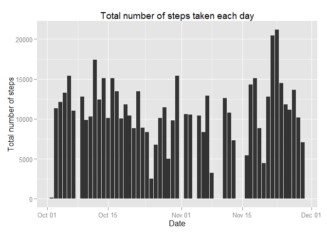
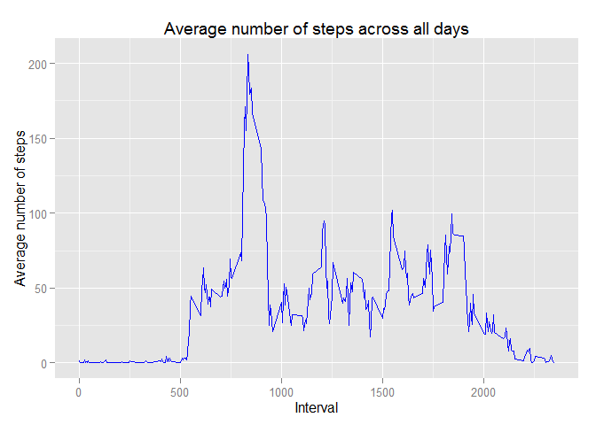
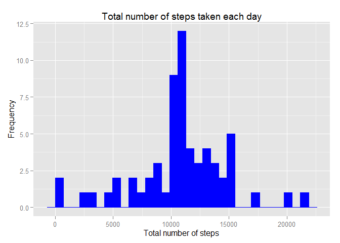
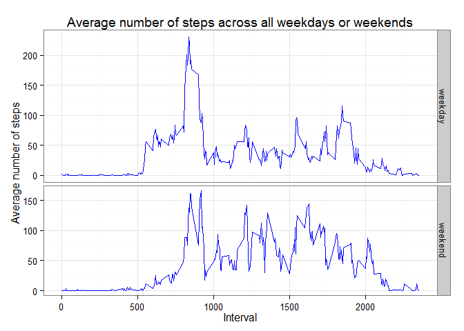

# Reproducible Research: Peer Assessment 1


```r
library(ggplot2)
```

### Loading and preprocessing the data
The data is processed into the following format.

```r
dt <- read.csv("activity.csv", colClasses = c("numeric", "Date", "integer"))
str(dt)
```

```
## 'data.frame':	17568 obs. of  3 variables:
##  $ steps   : num  NA NA NA NA NA NA NA NA NA NA ...
##  $ date    : Date, format: "2012-10-01" "2012-10-01" ...
##  $ interval: int  0 5 10 15 20 25 30 35 40 45 ...
```


### What is mean total number of steps taken per day?
For this part of the assignment, the missing values in the dataset are ignored.

```r
dt2 <- dt[complete.cases(dt),]
```

The following plot shows a histogram of the total number of steps taken each day.

```r
ggplot(dt2, aes(x=date, y=steps)) + 
    geom_bar(stat="identity") + 
    labs(title="Total number of steps taken each day", 
        x="Date", y="Total number of steps")
```



The mean and median total number of steps taken per day are

```r
dt2Agg <- aggregate(dt2$steps, list(date = dt2$date), FUN = "sum")
colnames(dt2Agg) <- c("date", "totalSteps")
mean(dt2Agg$totalSteps)
```

```
## [1] 10766
```

```r
median(dt2Agg$totalSteps)
```

```
## [1] 10765
```


### What is the average daily activity pattern?
We tabulate the average number of steps taken, averaged across all days, against 5-minute intervals using the above dataset. 

```r
dt2Agg2 <- aggregate(dt2$steps, list(interval = dt2$interval), FUN = "mean")
colnames(dt2Agg2) <- c("interval", "avSteps")
```

The following plot shows a time series plot of the average number of steps taken against the 5-minute intervals. 

```r
ggplot(dt2Agg2, aes(interval, avSteps)) +
    geom_line(colour="blue") +
    labs(title="Average number of steps across all days", 
         x="Interval", y="Average number of steps")
```



The 5-minute interval that contains the maximum number of steps on average across all the days in the dataset is

```r
dt2Agg2[dt2Agg2$avSteps==max(dt2Agg2$avSteps),]
```

```
##     interval avSteps
## 104      835   206.2
```


### Imputing missing values
Note that there are a number of days/intervals where there are missing values (coded as NA). The presence of missing days may introduce bias into some calculations or summaries of the data.

The total number of missing values in the dataset is

```r
sum(is.na(dt$steps))
```

```
## [1] 2304
```

We create a new dataset by filling in all of the missing values in the dataset using the mean for that 5-minute interval.

```r
dtNew <- dt
for(id in 1:nrow(dtNew)){
    if (is.na(dt$steps[id])){
        dtNew$steps[id] <- dt2Agg2$avSteps[which(dt$interval[id]==dt2Agg2$interval)]
    }
}
```

We tabulate the total number of steps taken each day using the new dataset.

```r
dtNewAgg <- aggregate(dtNew$steps, list(date = dtNew$date), FUN = "sum")
colnames(dtNewAgg) <- c("date", "totalSteps")
```

The following plot shows a histogram of the total number of steps taken each day of the new dataset.

```r
ggplot(dtNewAgg, aes(x=date, y=totalSteps, fill=totalSteps)) + 
    geom_bar(stat="identity") + 
    labs(title="Total number of steps taken each day", 
        x="Date", y="Total number of steps")
```



The new mean and median total number of steps taken per day are
```
mean(dtNewAgg$totalSteps)
median(dtNewAgg$totalSteps)
```

Comparing the mean and median before and after imputing missing data,

```r
mean(dtNewAgg$totalSteps) - mean(dt2Agg$totalSteps)
```

```
## [1] 0
```

```r
median(dtNewAgg$totalSteps) - median(dt2Agg$totalSteps)
```

```
## [1] 1.189
```

This means that the values are very close to the estimates from the first part of the assignment. Imputing missing data does not affect much on the estimates of the total daily number of steps.


### Are there differences in activity patterns between weekdays and weekends?
Using the new dataset with the filled-in missing values, we create a new factor variable in the dataset with two levels - "weekday" and "weekend" indicating whether a given date is a weekday or weekend day.

```r
dtNew$dayWk <- factor(weekdays(dtNew$date))
levels(dtNew$dayWk) <- list(weekday = c("Monday", "Tuesday", "Wednesday", "Thursday", "Friday"),
                             weekend = c("Saturday", "Sunday"))
```

We tabulate the average number of steps taken, averaged across all weekday days or weekend days, against the 5-minute interval.

```r
dtNewAgg2 <- aggregate(dtNew$steps, list(interval = dtNew$interval, dayWk = dtNew$dayWk), 
                       FUN = "mean")
colnames(dtNewAgg2) <- c("interval", "dayWk", "avSteps")
```

The following shows a panel plot containing a time series plot of the 5-minute interval and the average number of steps taken, averaged across all weekday days or weekend days.

```r
ggplot(dtNewAgg2, aes(interval, avSteps, fill=dayWk)) +
    geom_line(colour="blue") +
    theme_bw() + guides(fill=FALSE) +
    facet_grid(dayWk~., scales="free", space="free") + 
    labs(title="Average number of steps across all weekdays or weekends", 
         x="Interval", y="Average number of steps")
```

 
